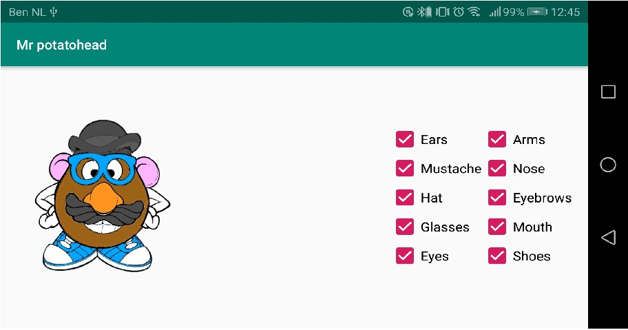
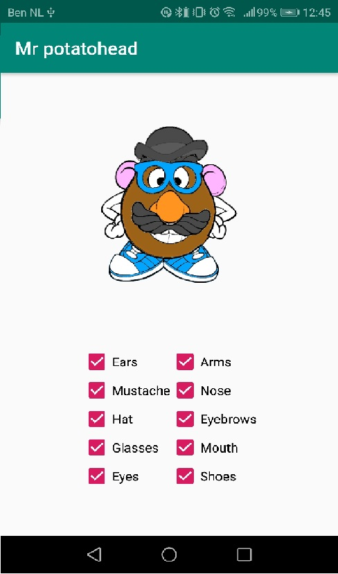
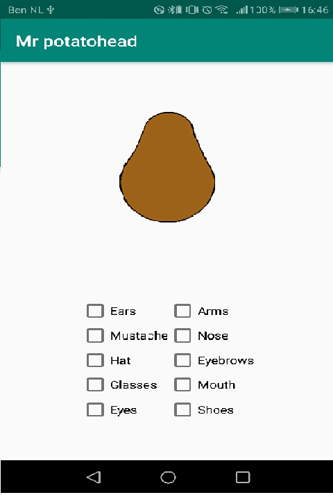

Ik heb een mister potatohead gemaakt waarbij je de verschillende onderdelen aan en uit kan zetten.
Hij werkt ook in land mode en hij onthoud wat je aan / uit staat wanneer hij omdraait.

Ik heb ook het icon van de app veranderd, naar mr potato

